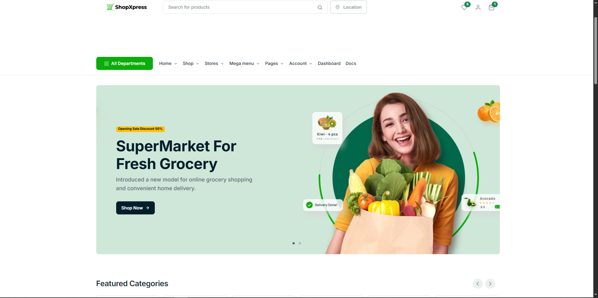
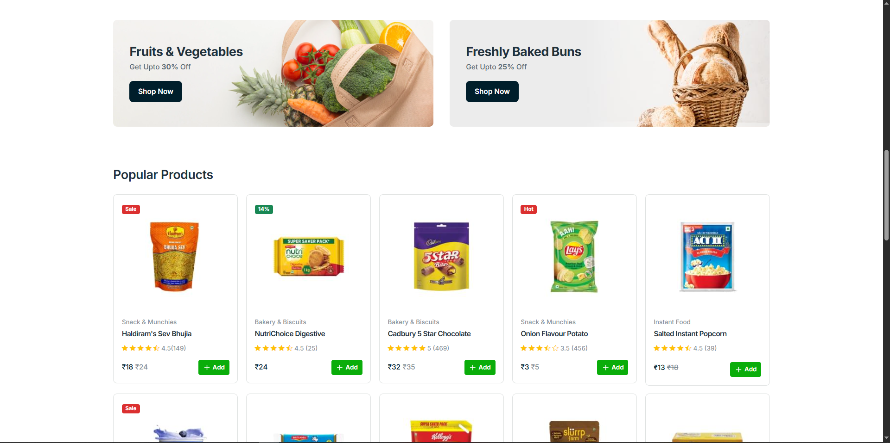
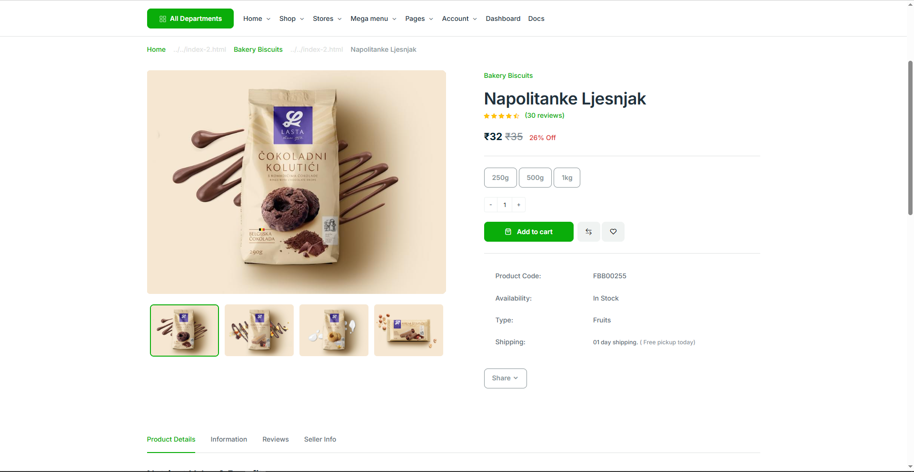
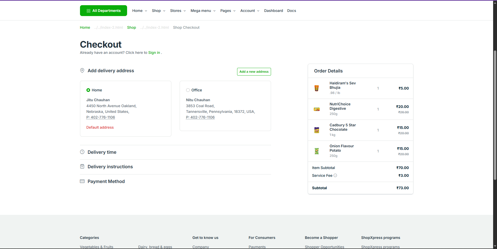

# 🛒 ShopXpress — Society-Based Daily Essentials Marketplace

**ShopXpress** is a web and mobile-based platform designed to help people in local societies fulfill their day-to-day basic needs such as **milk, fruits, vegetables, groceries, and medicines**. It connects **buyers and local sellers** within the same community, promoting hyperlocal commerce and convenience.

---

## 🔥 Features

- 🧍 User and Seller role-based login
- 📦 Sellers can list daily-use items (milk, fruits, vegetables, medicine, etc.)
- 🛒 Buyers can browse, add to cart, and order items easily
- 📍 Location/Society-based product listings
- 🔔 Notifications and order updates
- 💸 Secure payment integration
- 🧾 Order history and delivery tracking
- 📊 Admin dashboard to monitor transactions and users
- 🌐 Mobile-responsive UI

---

## 💻 Technology Stack

- **Backend**: nodejs
- **Frontend**: HTML, CSS, JavaScript, Bootstrap
- **Database**: mongodb
- **Version Control**: Git & GitHub

---

## 📽️ Project Demo

**🔗 Video Presentation**: [Watch here](https://drive.google.com/file/d/1MQIH08FtFYHb0uPxfO7mjJyKYmUjZ4pb/view?usp=sharing)

---Deployedment certificate:https://drive.google.com/drive/folders/1xGqihfyNFvqLKw8WMHdypQcQG9WXlnTg?usp=sharing

ppt : (https://drive.google.com/drive/folders/1SczZGn4iNU8fZlWuaTPL5FPQCZi6-Krf?usp=sharing)

## 📄 Project Resources

- **📑 Report**: [Project Report (Google Doc)](https://docs.google.com/document/d/1N0hOc7tITM6NJ-0n0rmNnKxT3tz2Zlnm/edit?usp=drive_link&ouid=110297507664336986665&rtpof=true&sd=true)

## 🖼️ UI Screenshots

### 🏠 Home Page  

---

### 🛒 Product Listings  

---

